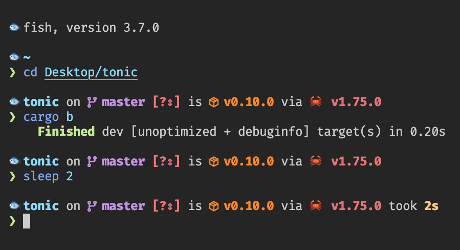

# .config

> 🔤 **[FiraCode Nerd Font]**, a patched font with programming ligatures  
> 🐟 **[FishShell]**, a smart and user-friendly command line shell  
> 🚀 **[Starship]**, a cross-shell prompt



## TL;DR

Install Fish & Starship.rs

```bash
$ brew install fish starship
```

Add Fish to available shells and set it as default

```bash
$ which fish | sudo tee -a /etc/shells
$ chsh -s $(which fish)
```

Configure Fish & Starship.rs

```bash
$ cd ~/.config && \
  git init && \
  git remote add origin https://github.com/bxneter/.config -f && \
  git reset --hard origin/master
```

<br>

---

#### Helpful links

🔥 [Moving from Oh-My-Zsh to Starship & Fish Shell
](https://www.joshfinnie.com/blog/moving-from-oh-my-zsh-to-starship-and-fish-shell/)

[FiraCode Nerd Font]: https://github.com/ryanoasis/nerd-fonts/tree/master/patched-fonts/FiraCode
[FishShell]: https://fishshell.com/
[preview]: .docs/preview.png
[Starship]: https://starship.rs/
